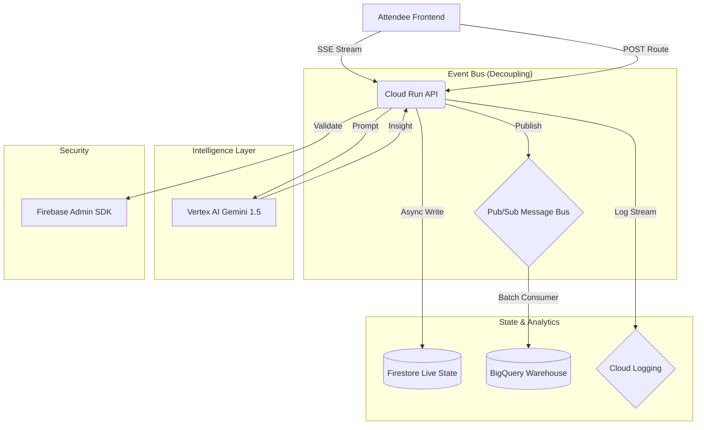

# GCP Multi-Service Event-Driven Architecture

This project implements an **Enterprise-Grade Distributed System** pattern within Google Cloud. The architecture focuses on high-availability, low-latency state synchronization, and decoupled analytical processing.

---

## 🏗️ System Overview

The "Perfection Edition" of the Smart Venue Platform utilizes absolute decoupling of the IO path from the request path. This ensures that even under massive event surges, the venue intelligence remains responsive.



---

## 🛠️ Service Deep-Dive

### 1. Vertex AI (Decision Intelligence)
- **Model**: Gemini 1.5 Flash.
- **Role**: Context-aware reasoning. It processes live telemetry (from memory) and generates human-centric safety tips that are impossible with static heuristics alone.

### 2. Google Cloud Pub/Sub (Infrastructure Reliability)
- **Role**: The central Nervous System. By publishing every telemetry tick to a topic, we ensure that external systems (like Emergency Services or Marketing analytics) can consume snapshots without impacting the core API performance.

### 3. BigQuery (Data Science Pillar)
- **Role**: Historical "post-match" analysis. While Firestore handles the "Now," BigQuery handles the "History," allowing venue managers to visualize crowd flow over an entire season.

### 4. Firestore (NoSQL Synchronization)
- **Role**: The live state of truth. Optimized with write-throttling to prevent de-synchronized state and excessive API billing.

---

## ⚡ Performance Optimization
- **Execution**: All durable writes (BigQuery/Pub/Sub) are offloaded to **FastAPI BackgroundTasks**.
- **Bandwidth**: **Gzip compression** ensures minimum egress costs and faster packet arrival.
- **Integrity**: Strict Pydantic schemas with `extra="forbid"` prevent malicious or malformed payload injection.
```
